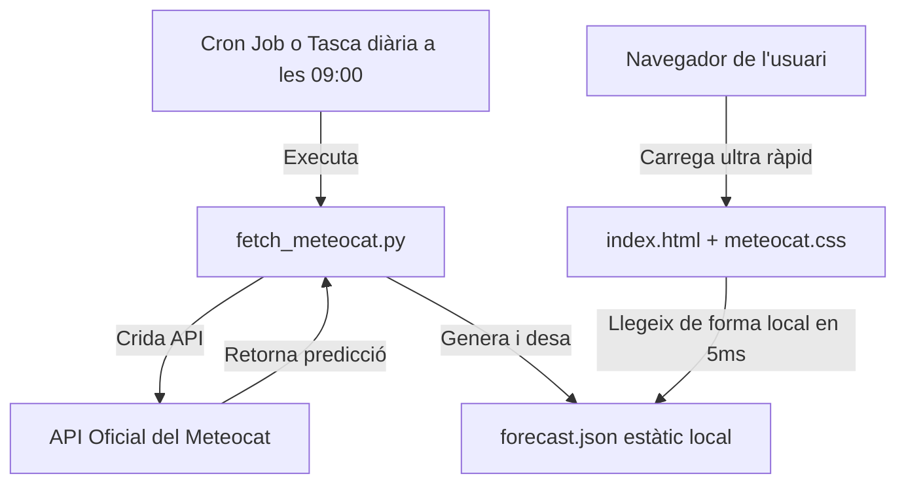

# weewx-meteocat

Predicció meteorològica del **Meteocat** dissenyada específicament com un giny (widget) ultra ràpid per integrar fàcilment a les plantilles de **WeeWX**.

## Característiques

*   **Rendiment instantani (Ultra ràpid)**: El giny no fa crides a APIs externes des del navegador del client. Simplement carrega de forma asíncrona un fitxer estàtic local `forecast.json` de menys d'1 KB que es troba al mateix servidor.
*   **Icones professionals**: Utilitza la llibreria [Weather Icons](https://github.com/erikflowers/weather-icons) descarregada completament de forma local (al teu propi servidor) per evitar dependències o CDNs externs.
*   **Disseny modern i adaptatiu (Responsive)**: S'ajusta automàticament a pantalles de mòbils, tauletes o ordinadors.
*   **Completament en català**: Noms de dies, mesos i descripcions meteorològiques adaptades de forma nativa.

---

## Estructura del Projecte

```text
weewx-meteocat/
├── fetch_meteocat.py       # Script en Python que descarrega l'API i genera el JSON
├── README.md               # Documentació d'instal·lació i ús
└── prototype/              # Fitxers del giny preparats per al servidor web
    ├── index.html          # Estructura del giny i codi JS asíncron de càrrega
    ├── meteocat.css        # Estils i disseny modern adaptatiu
    ├── forecast.json       # Fitxer de dades local actualitzat (creat per l'script)
    └── weather-icons/      # Llibreria d'icones allotjada de forma local
        ├── css/
        └── font/
```

---

## Com funciona l'arquitectura?

Per mantenir la teva web de WeeWX instantània i respectar els límits de l'API de Meteocat (sense fer crides innecessàries de clients des de milers de navegadors), s'ha separat el giny en dues parts:



---

## Guia d'Instal·lació i Integració

### 1. Preparar els fitxers al servidor de WeeWX

Copia el contingut del directori `prototype/` (incloent `weather-icons/`, `meteocat.css` i `index.html`) al directori públic del teu servidor web de WeeWX (habitualment `/var/www/html/weewx/` o `/home/weewx/public_html/`).

### 2. Configurar el script de descàrrega diària (`fetch_meteocat.py`)

Aquest script en Python s'encarrega d'alimentar la predicció una vegada al dia. **No té cap dependència externa (no cal instal·lar paquets amb pip)** per garantir la màxima estabilitat.

#### Prova de funcionament (Mode Simulació / Mock):
Pots provar el script sense claus d'API per veure com genera el fitxer de dades correctament:
```bash
python3 fetch_meteocat.py --nom "Barcelona · Congrés i els Indians" --output prototype/forecast.json
```

#### Configuració amb l'API de Meteocat:
Un com tinguis la teva API Key de Meteocat, defineix la variable d'entorn i executa-ho:
```bash
export METEOCAT_API_KEY="LA_TEVA_API_KEY_AQUÍ"
python3 fetch_meteocat.py --municipi "080193" --output /var/www/html/weewx/forecast.json
```
*(On `"080193"` és el codi oficial INE de municipi per a Barcelona, pots utilitzar el codi de la teva ubicació).*

### 3. Automatitzar la descàrrega a les 9:00 del matí (amb Cron)

Per tal que la predicció s'actualitzi automàticament cada dia a les **09:00 h**, configura una tasca cron al teu servidor Linux:

1. Obre el configurador de cron:
   ```bash
   crontab -e
   ```
2. Afegeix la següent línia al final (assegura't d'ajustar les rutes absolutes del teu sistema):
   ```text
   00 9 * * * export METEOCAT_API_KEY="LA_TEVA_API_KEY_AQUÍ" && /usr/bin/python3 /ruta/a/fetch_meteocat.py --municipi "080193" --output /var/www/html/weewx/forecast.json > /dev/null 2>&1
   ```

---

## Integració del Giny a la teva plantilla WeeWX

Pots incrustar aquest giny a qualsevol lloc de la teva pàgina web existent de dues maneres molt senzilles:

### Opció A: Mitjançant un `<iframe>` (Recomanat per la simplicitat)
Incrusta la predicció directament en qualsevol pàgina de WeeWX:
```html
<iframe src="index.html" style="width: 100%; height: 280px; border: none; overflow: hidden;" scrolling="no"></iframe>
```

### Opció B: Integració directa en HTML (Inline)
1. Afegeix les fulles d'estil a la capçalera (`<head>`) de la teva plantilla:
   ```html
   <link rel="stylesheet" href="weather-icons/css/weather-icons.min.css">
   <link rel="stylesheet" href="meteocat.css">
   ```
2. Copia l'estructura de contenidors en qualsevol part del cos (`<body>`):
   ```html
   <div class="weather-widget">
       <div class="widget-header">
           <div>
               <div class="widget-title">Predicció meteorològica</div>
               <div class="widget-location" id="widget-location">Cargant...</div>
           </div>
           <div class="widget-source">Meteocat</div>
       </div>
       <div class="forecast" id="forecast-container"></div>
       <div class="widget-footer">
           <span>Predicció per als propers 8 dies</span>
           <span id="updated-at">...</span>
       </div>
   </div>
   ```
3. Afegeix el script asíncron JavaScript al final de la pàgina per carregar les dades des del teu `forecast.json` local.
